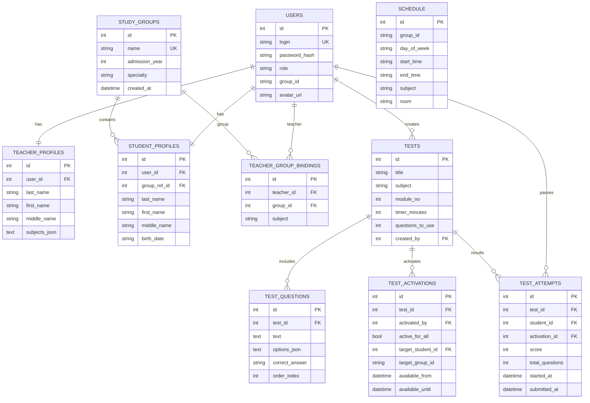

# EDU Kernel

Система учета студентов (backend Flask + frontend Expo React Native/Web).

## Структура

```text
students/
├── backend/
│   ├── app/
│   ├── sql/
│   │   ├── schema.sql
│   │   └── full_backup.sql
│   ├── database.db
│   ├── requirements.txt
│   └── run.py
└── frontend/
    ├── app/
    ├── package.json
    └── App.js
```

## Установка и запуск (Linux)

```bash
cd /home/jackson/students/backend
python3 -m venv .venv
source .venv/bin/activate
pip install -r requirements.txt
python run.py
```

Во втором терминале:

```bash
cd /home/jackson/students/frontend
npm install
npx expo start
```

## Установка и запуск (Windows, PowerShell)

```powershell
cd C:\path\to\students\backend
py -m venv .venv
.\.venv\Scripts\Activate.ps1
pip install -r requirements.txt
python run.py
```

Во втором окне PowerShell:

```powershell
cd C:\path\to\students\frontend
npm install
npx expo start
```

## Восстановление БД после удаления `database.db`

Перед восстановлением остановите backend (`Ctrl+C`), чтобы файл БД не был занят.

### Вариант 1: Полное восстановление (структура + текущие данные)

Linux:

```bash
cd /home/jackson/students
python backend/app/utils/reset_db.py --mode full
```

Windows:

```powershell
cd C:\path\to\students
python backend\app\utils\reset_db.py --mode full
```

### Вариант 2: Только структура таблиц

```bash
python backend/app/utils/reset_db.py --mode schema
```

### Вариант 3: Чистая БД + демо-наполнение для тестов (`pcs-1-23`)

```bash
python backend/app/utils/reset_db.py --mode demo
```

Демо-режим заполняет:
- `admin/admin123`
- группу `pcs-1-23`
- преподавателей, привязки, расписание
- студентов
- тесты и вопросы

### Антикризисный сценарий (рекомендуется)

Если база удалена и нужно быстро вернуть рабочее состояние для тестирования:

```bash
cd /home/jackson/students
python backend/app/utils/reset_db.py --mode demo
```

После этого сразу будут:
- логин `admin` / пароль `admin123`,
- заполненная группа `pcs-1-23`,
- привязанные преподаватели и предметы,
- расписание группы,
- созданные и активированные тесты.

## SQL-файлы

- Схема: [backend/sql/schema.sql](backend/sql/schema.sql)
- Полный дамп: [backend/sql/full_backup.sql](backend/sql/full_backup.sql)
- Описание SQL-файлов: [backend/sql/README.md](backend/sql/README.md)

Можно восстановить и вручную:

```bash
sqlite3 backend/database.db < backend/sql/full_backup.sql
```

## Базовая схема данных



## Базовые роли и данные

- `admin` — полный доступ.
- `teacher` — преподаватели (оценки, посещаемость, тесты, ДЗ).
- `student` — студенты (свои данные, тесты, оценки, ДЗ).
- `scheduler` — расписание, новости, библиотека.

Базовый учебный набор для быстрого старта:
- группа `pcs-1-23`,
- студенты с логинами вида `pcs-1-23-0001 ...`,
- преподаватели и привязки по предметам,
- расписание и тесты.

## Дефолтный вход

- Логин: `admin`
- Пароль: `admin123`

## Перенос БД в Supabase (PostgreSQL)

В проекте подготовлен комплект миграции:

- [backend/supabase/01_schema.sql](backend/supabase/01_schema.sql) — схема Postgres.
- [backend/supabase/02_data.sql](backend/supabase/02_data.sql) — данные из текущей `backend/database.db`.
- [backend/supabase/03_source_counts.md](backend/supabase/03_source_counts.md) — контрольные количества строк.
- [backend/supabase/README.md](backend/supabase/README.md) — пошаговый импорт.

Бэкенд уже поддерживает `DATABASE_URL` для Supabase.

Пример `.env` для backend:

```env
DATABASE_URL=postgresql://postgres.<PROJECT_REF>:<PASSWORD>@aws-0-<REGION>.pooler.supabase.com:6543/postgres?sslmode=require
SECRET_KEY=change-me
STORAGE_BACKEND=supabase
SUPABASE_URL=https://<PROJECT_REF>.supabase.co
SUPABASE_SERVICE_ROLE_KEY=<SUPABASE_SERVICE_ROLE_KEY>
SUPABASE_STORAGE_BUCKET=edu-kernel
SUPABASE_STORAGE_PREFIX=uploads
SUPABASE_STORAGE_PUBLIC=true
SUPABASE_STORAGE_AUTO_CREATE_BUCKET=true
```

> Файл-шаблон: [backend/.env.supabase.example](backend/.env.supabase.example)

### Что значит «backend полностью в Supabase»

- Данные приложения: Supabase Postgres (`DATABASE_URL`).
- Файлы (аватары, чат, новости, ДЗ, библиотека): Supabase Storage (`STORAGE_BACKEND=supabase`).
- При старте backend автоматически использует Supabase-хранилище для новых файлов.
- Для переноса уже существующих локальных файлов выполните:

```bash
cd backend
python scripts/migrate_uploads_to_supabase.py
```

## Локальная копия проекта

Сделана отдельная полная копия для локального запуска:

- `/home/jackson/students_local`

## Docker + Koyeb

- Dockerfile backend: [backend/Dockerfile](backend/Dockerfile)
- Локальный запуск Docker: [backend/docker_local.md](backend/docker_local.md)
- Деплой Koyeb: [backend/koyeb.md](backend/koyeb.md)
- Env-шаблон для Koyeb: [backend/.env.koyeb.example](backend/.env.koyeb.example)

Проверка Supabase подключения:

```bash
cd backend
./.venv/bin/python scripts/check_supabase.py
```
